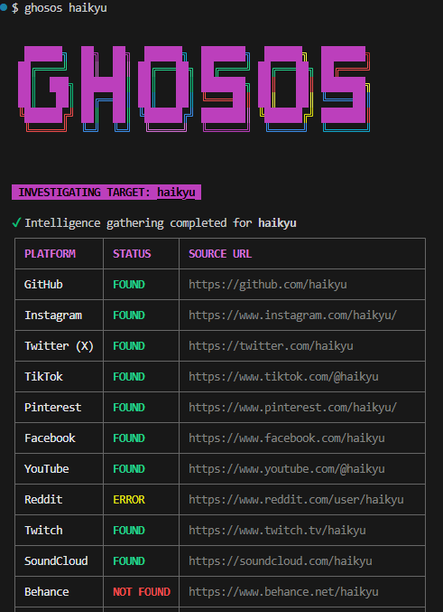

# Ghosos-CLI 👻

**Ghosos-CLI** is a "stealth-mode" username investigation tool (OSINT). It checks username availability across various social media platforms with high speed using Node.js asynchronous processing and a stylish terminal interface.




## Key Features
- **Parallel Scanning:** Fast checking using `Promise.allSettled`.
- **Ghost-Identity:** Automatic `User-Agent` rotation to avoid bot detection.
- **Advanced Validation:** Content-based validation to minimize false positives.
- **Interactive UI:** Dynamic progress bar and clean result tables.

## Installation
```bash
# Clone the repository
git clone https://github.com/ideapedyudi/ghosos-cli.git

# Enter the directory
cd ghosos-cli

# Install dependencies
npm install

# Link the command globally (optional)
npm link
```

## Usage
```bash
ghosos <username>
```

## Technology
- [Node.js](https://nodejs.org/)
- [Commander.js](https://github.com/tj/commander.js/)
- [Axios](https://github.com/axios/axios)
- [Chalk](https://github.com/chalk/chalk)
- [Ora](https://github.com/sindresorhus/ora)
- [User-Agents](https://github.com/intoli/user-agents)
